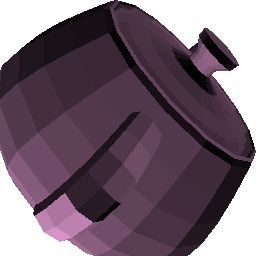
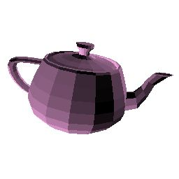
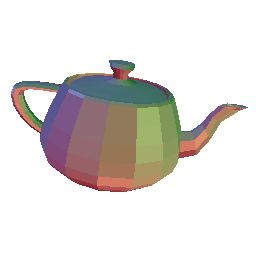
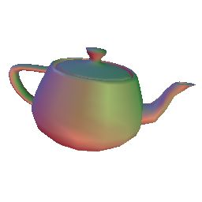
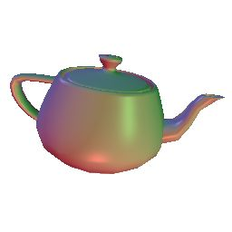
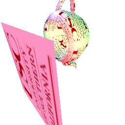

USC CS580 3D Graphics Homeworks 1-6\
Basic 3D rendering library implemented as a Visual Studio Community 2019 application.\
\
Most of the renderer code is found in rend.cpp in homeworks\
HW1 - Basic framebuffer/pixelbuffer loading\
HW2 - Triangle rasterization using Scan-Line/LEE (I used scanlines for this assignment)\
\
HW3 - Matrix stack transformations to configure camera and perspective projection\
\
HW4 - Basic Flat/Gouraud/Phong shading\

\
HW5 - UV Texture mapping, procedural textures and perspective correct parameters\
\
HW6 - Anti-Aliasing and Accumulation buffer\
\
Final Project - Soft Body Physics using Positon Based Dynamics\

